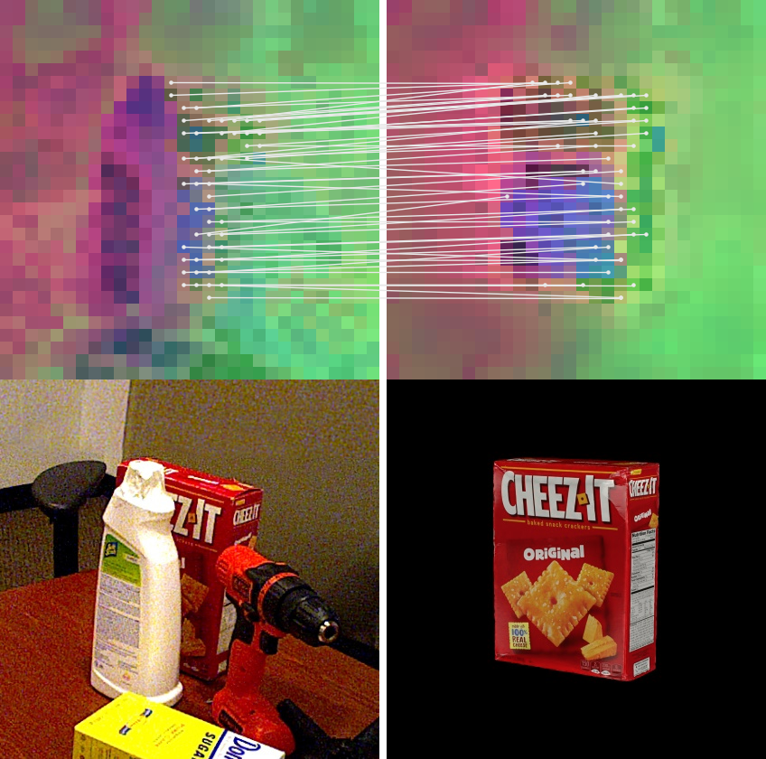

<p align="center">
  <h1 align="center">FoundPose <br>Unseen Object Pose Estimation with Foundation Features</h1>
  <p align="center">
    <a href="https://evinpinar.github.io">Evin Pınar Örnek</a>
    ·
    <a href="https://ylabbe.github.io">Yann Labbé</a>
    ·
    <a href="https://btekin.github.io">Bugra Tekin</a>
    ·
    <a href="https://www.linkedin.com/in/lingnima/">Lingni Ma</a><br>
    <a href="https://www.linkedin.com/in/cem-keskin-23692a15">Cem Keskin</a>
    ·
    <a href="https://www.cforster.ch">Christian Forster</a>
    ·
    <a href="https://cmp.felk.cvut.cz/~hodanto2/">Tomas Hodan</a>
  </p>
  <h3 align="center">
    <p>ECCV 2024</p>
    <a href="https://arxiv.org/abs/2311.18809" align="center">Arxiv</a>
    ·
    <a href="https://www.ecva.net/papers/eccv_2024/papers_ECCV/papers/03742.pdf" align="center">Publication</a>
    ·
    <a href="https://www.ecva.net/papers/eccv_2024/papers_ECCV/papers/03742-supp.pdf" align="center">Supplementary</a>
    
  </h3>
</p>

<p align="center">
  
</p>

##

This is the official implementation of our work **FoundPose** which proposes a novel model-based 6DoF pose estimation method for unseen objects, built on top of [DINOv2](https://github.com/facebookresearch/dinov2) features. In this repository, we provide the coarse pose estimation pipeline without the featuremetric refinement stage. 

Our training-free method does not require the release of any weights. In this repository, we release the created object templates, representation and the inference outputs as a reference. 

## Table of Contents

- [Setup](#setup)
   - [Environment](#environment)
   - [Dataset](#dataset)
   - [Dataset Directory Structure](#dataset-directory-structure)
- [Using FoundPose](#foundpose)
   - [1. Render the Templates](#render-the-templates)
   - [2. Create Object Representation](#create-object-representation)
   - [3. Run Pose Estimation](#run-pose-estimation)
   - [4. Evaluation](#evaluation)
- [Acknowledgements](#acknowledgements)
- [License](#license)

## Setup <a name="setup"></a>

### Environment <a name="environment"></a>

Download the code with the git submodules and navigate to the folder:

```bash
git clone --recurse-submodules https://github.com/facebookresearch/foundpose
cd foundpose
```

Setup the [conda](https://docs.conda.io/projects/conda/en/latest/user-guide/getting-started.html) environment for MacOSX (MPS):
```bash
conda env create -f conda_foundpose_mps.yaml
```
For CUDA (GPU support):
```bash
conda env create -f conda_foundpose_gpu.yaml
```

Next, create (or update) the conda environment activation script to set the necessary environment variables. This script will run automatically when you activate the environment.

The activation script is typically located at ```$CONDA_PREFIX/etc/conda/activate.d/env_vars.sh```. You can find ```$CONDA_PREFIX``` by running:
```bash
conda info --envs
```
If the ```env_vars.sh``` file does not exist, create it. 

Edit the ```env_vars.sh``` file as follows:

```bash
#!/bin/sh

export REPO_PATH=/path/to/foundpose/repository  # Replace with the path to the FoundPose repository.
export BOP_PATH=/path/to/bop/datasets  # Replace with the path to BOP datasets (https://bop.felk.cvut.cz/datasets).

export PYTHONPATH=$REPO_PATH:$REPO_PATH/external/bop_toolkit:$REPO_PATH/external/dinov2
```

Activate the conda environment:
```bash
conda activate foundpose_mps  # or foundpose_gpu
```

### Dataset <a name="dataset"></a>

Download the BOP datasets from [here](https://bop.felk.cvut.cz/datasets/) and ensure they are organized in the expected folder structure. Note that we only need the models and test images (PBR images are not needed). 

Update the ```output_path``` in the BOP config file located at ```external/bop_toolkit/bop_toolkit_lib/config.py```  to point to the root directory of your BOP datasets.

Download the default segmentations created for Task 4 at BOP 2023 Challenge [from here](https://bop.felk.cvut.cz/media/data/bop_datasets_extra/bop23_default_detections_for_task4.zip) which were created by [CNOS](https://bop.felk.cvut.cz/method_info/370/). Place the downloaded files under: 
```
{$output_path}/detections/cnos-fastsam/cnos-fastsam_{dataset}_test.json
```
Replace ```{dataset}``` with the name of the dataset you are using (e.g., lmo for LM-O).

### Directory Structure <a name="dataset-directory-structure"></a>

Your BOP datasets should be organized in the following directory structure:

```bash
bop_datasets/               # This is your $BOP_PATH
├── lmo/                    # Dataset directory for LM-O
│   ├── camera.json
│   ├── dataset_info.md
│   ├── models/             # 3D models of the objects
│   ├── models_eval/        # Simplified models for evaluation
│   ├── test/               # Test images and annotations
│   └── ...
└── ...
```

The detections directory should be placed under your output_path as configured in ```external/bop_toolkit/bop_toolkit_lib/config.py```:

```bash
$OUTPUT_PATH/
├── detections/
│   └── cnos-fastsam/
│       ├── cnos-fastsam_lmo_test.json
│       ├── cnos-fastsam_tudl_test.json
│       └── ...
└── ...
```

## Using FoundPose <a name="foundpose"></a>

### 1. Generating templates <a name="render-the-templates"></a>

You can render the templates using the following script and the provided configuration file (e.g., for the LM-O dataset). To use other datasets, create a similar configuration file accordingly. 

Run the following command:

```bash
python scripts/gen_templates.py --opts-path configs/gen_templates/lmo.json
```
This script generates images, masks, depth maps, and camera parameters in the $output_path.

Note: We provide the generated object templates for LM-O [here](https://huggingface.co/datasets/evinpinar/foundpose/resolve/main/templates.zip).


### 2. Generating object representation <a name="create-object-representation"></a>

You can create the object representation using the following script and configuration file (e.g., for the LM-O dataset):
```
python scripts/gen_repre.py --opts-path configs/gen_repre/lmo.json
```

Note: We provide the generated object representations for LM-O [here](https://huggingface.co/datasets/evinpinar/foundpose/resolve/main/object_repre.zip).

### 3. Inference <a name="run-pose-estimation"></a>

You can run coarse-level pose estimation for the LM-O dataset using the following script and configuration file:  
```
python scripts/infer.py --opts-path configs/infer/lmo.json
```
This will generate output poses in the BOP format.

Note: We provide pose estimations based on the provided representations for LM-O [here](https://huggingface.co/datasets/evinpinar/foundpose/resolve/main/inference.zip).

### 4. Evaluation <a name="evaluation"></a>

Create a BOP submission file by running the command by specifying the dataset, version and object ids within the script: 
```
python scripts/prepare_bop_submission.py
```

We report the results produced by this open-source repository and compare them with the published results. The main difference between the implementation used to get the scores reported in the paper and the open-source implementation is the renderer (for the paper we used an internal renderer).

Results using the DINOv2 ViT-S Model:

| Dataset   | Published AR  | Reproduced AR |
|-----------|---------------|---------------|
| LMO       | 34.0          | 33.7          |
| TUD-L     | 42.7          | 40.7          |


## Acknowledgements <a name="acknowledgements"></a>

If you find this work useful in your research, please cite

```
@article{
  ornek2024foundpose,
  author    = {{\"O}rnek, Evin P{\i}nar and Labb\'e, Yann and Tekin, Bugra and Ma, Lingni and Keskin, Cem and Forster, Christian and Hoda{\v{n}}, Tom{\'a}{\v{s}}},
  title     = {FoundPose: Unseen Object Pose Estimation with Foundation Features}, 
  journal   = {European Conference on Computer Vision (ECCV)},
  year      = {2024},
}
```

This repository relies on external codebases of [DINOv2](https://github.com/facebookresearch/dinov2) and [BOP Toolkit](https://github.com/thodan/bop_toolkit/tree/master). We thank the authors for making their code available.


## License <a name="license"></a>

This project is licensed under the [Creative Commons Attribution-NonCommercial 4.0 International License (CC BY-NC 4.0)](http://creativecommons.org/licenses/by-nc/4.0/). [](http://creativecommons.org/licenses/by-nc/4.0/)

